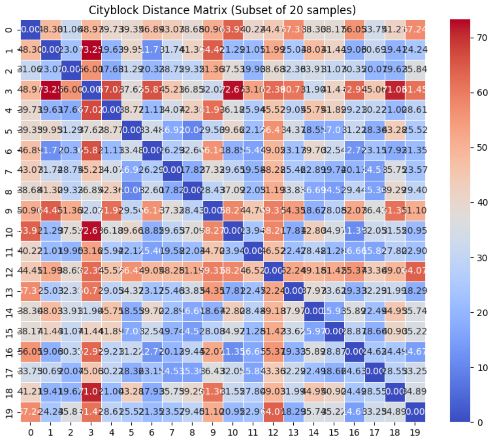

# Візуалізація матриць відстаней

## Опис проєкту

Це домашнє завдання присвячене обчисленню та візуалізації матриць відстаней для різних метрик, таких як:
- Cityblock (Manhattan)
- Cosine
- Euclidean
- L1
- Manhattan

### Мета
Основна мета проєкту — порівняти різні метрики відстаней для даного набору даних та візуалізувати їх за допомогою теплових карт (heatmaps) з використанням бібліотеки `seaborn`.

## Використані бібліотеки
Для виконання завдання були використані наступні бібліотеки:
- `seaborn`
- `matplotlib`
- `pandas`
- `scipy`

## Опис метрик відстаней
1. **Cityblock (або Manhattan) Distance**:
   - Вимірює суму абсолютних різниць між координатами двох точок.
   - Добре підходить для задач, де важливі зміни в кожній окремій ознаці.

2. **Cosine Distance**:
   - Вимірює кут між векторами і підходить для задач, де важливий напрямок ознак, а не їхні абсолютні значення.

3. **Euclidean Distance**:
   - Вимірює "прямолінійну" відстань між точками у просторі.

4. **L1 Distance**:
   - Синонім метрики Cityblock, вимірює абсолютні відмінності між значеннями.

5. **Manhattan Distance**:
   - Це також те ж саме, що і Cityblock/L1, тому результати однакові.

## Структура проекту

- **distance_matrices.py**: Скрипт для обчислення та візуалізації матриць відстаней.
- **README.md**: Опис проєкту та інструкції.
- **data**: Директорія з даними, що використовувалися для виконання завдання.

## Як запустити проєкт

1. Клонувати репозиторій:
   ```bash
   git clone https://github.com/username/project-name.git
   ```

2. Встановити залежності:
   ```bash
   pip install -r requirements.txt
   ```

3. Запустити скрипт для обчислення та візуалізації матриць відстаней:
   ```bash
   python hw_4.py
   ```

## Візуалізація

Скрипт генерує теплові карти для кожної метрики відстаней (Cityblock, Cosine, Euclidean, L1, Manhattan). Для прискорення виконання аналізу було візуалізовано підмножину перших 20 зразків.

Приклад теплової карти для метрики Cityblock:



## Висновки

- **Cityblock/L1/Manhattan** метрики добре підходять для даних, де важливі абсолютні зміни між ознаками.
- **Cosine Distance** фокусується на напрямках між векторами, що робить її корисною для текстових даних та інших векторних репрезентацій.
- **Euclidean Distance** проста та інтуїтивна, але може бути менш ефективною для даних з різними масштабами ознак.

## Автор

- **Антон Бабенко** - [bobantonbob](https://github.com/bobantonbob)
