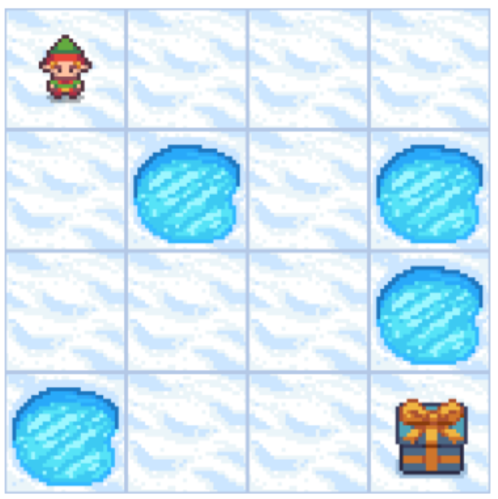
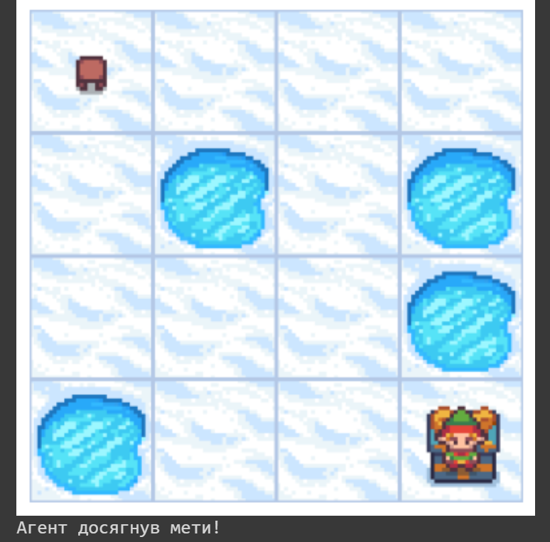

# Візуалізація шляху агента в середовищі FrozenLake-v1

Цей домашній проект демонструє застосування **ітерації за політикою** для навчання з підкріпленням у середовищі `FrozenLake-v1` за допомогою OpenAI Gym. Метою є навчити агента знаходити оптимальний шлях на замерзлому озері, щоб досягти цілі, уникаючи пасток.

## Огляд проекту

1. **Середовище**: `FrozenLake-v1`
2. **Метод**: Ітерація за політикою
3. **Мета**: Знайти оптимальну політику для агента, щоб максимізувати ймовірність досягнення цілі.

## Етапи

1. **Завантаження середовища** `FrozenLake-v1` за допомогою `gym.make('FrozenLake-v1')`.
2. **Обчислення функції вартості**: Реалізація функції `compute_value_function()` для оцінки поточної політики.
3. **Оптимізація політики**: Використання функції `policy_iteration()` для знаходження оптимальної політики.
4. **Візуалізація шляху агента**: Функція `show_render()` використовується для візуалізації шляху агента в середовищі згідно з оптимальною політикою.

## Візуалізація

Нижче наведені зображення агента на початку шляху та в момент досягнення мети.

### Початкова позиція

### Досягнення мети

## Результати

- Агент успішно досягає мети, використовуючи обчислену оптимальну політику, уникаючи пасток.
- Це демонструє ефективність ітерації за політикою у розв'язанні задач Марковських процесів ухвалення рішень у стохастичному середовищі.

## Вимоги

- `gym`
- `numpy`
- `matplotlib`
- `imageio`

## Використання

Запустіть скрипт hw_9.py для візуалізації шляху агента в середовищі `FrozenLake-v1`. Агент буде слідувати оптимальній політиці, обчисленій за допомогою `policy_iteration()`.
